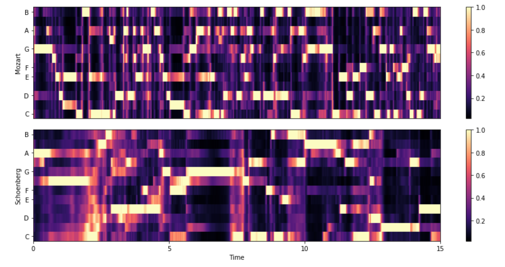
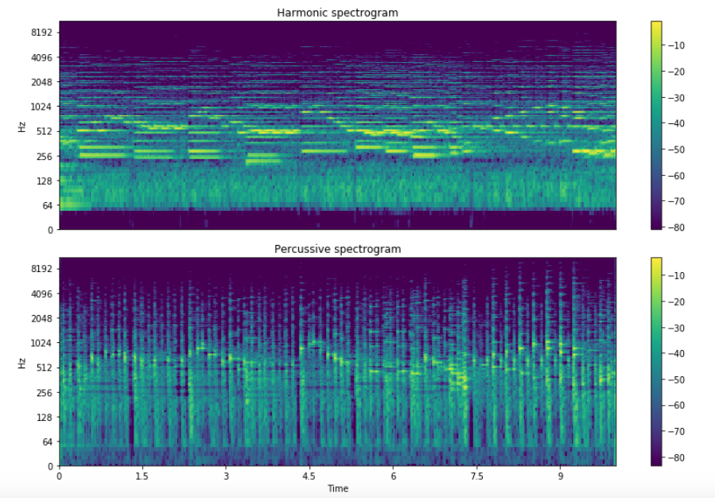

# Pyskine

### What
Like a Mokeskine, Pyskine is my python notebook for discoveries, ideas and prototypes. Being a huge fan of visualization, you are gonna see a lot of pretty(?) pictures in this notebook.

### When
I've made a soft resolution to write something every day! However, some days I might be using Mercury days*.

### How
Each folder is an entry that contains everything needed to run the notebook. 
Go to an entry and run `pip install -r requirements.txt`.

| | | |
|:-------------------------:|:-------------------------:|:-------------------------:|
||   |

---

  *: [Length of the day on other planets](https://simple.wikipedia.org/wiki/Length_of_day#Length_of_the_day_on_other_planets)

